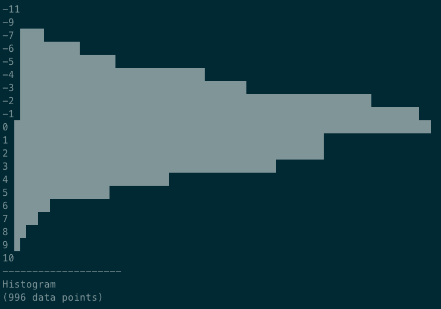

# Pipers
Python scripts to generate and moderate piped data.

Full working example:

`./gauss --type int --mu 0 --sigma 3 | ./slowline 0.001 | ./histogram 0.5`

The above command will:

1. Generate a gaussian distribution (3-sigma)
2. Cap the pipe to one line every 0.001 seconds
3. Draw a histogram of the values (every 0.5 seconds)

Example output:

## Generate

### Gaussian Distribution
    usage: gauss.py [-h] [--mu [MU]] [--sigma [SIGMA]] [--type {int,float}] [count]

    Generates Gaussian random numbers in the specified range. Default mode is floats in [0,1).

### Random Distribution
    usage: rand.py [-h] [--range from to] [--type {int,float}] [count]

    Generates random numbers in the specified range. Default mode is floats in [0,1).

## Moderate

### Slowline
    usage: slowline.py [-h] delay

    Bottlenecks a piped process to output a line every N seconds (>= 0.001). Guarantees the delay to be at least N seconds.

### Slow
    usage: slow.py [-h] delay chunksize

    Bottlenecks a piped process to output X bytes every N seconds (>= 0.001). Guarantees the delay to be at least N seconds.

## Plot

### Histogram
    usage: histogram.py [-h] [delay]

    Generates a pretty histogram dynamically.
